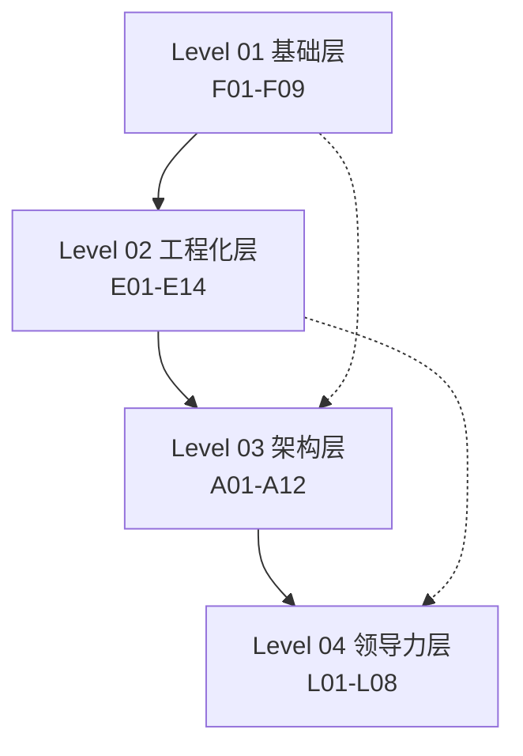
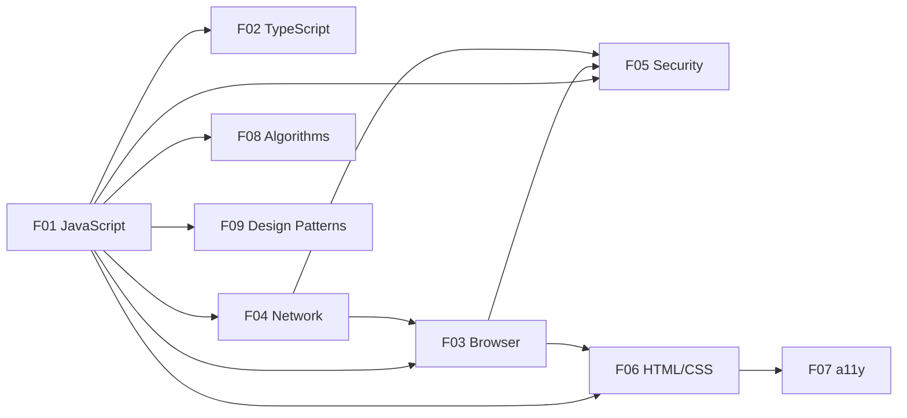
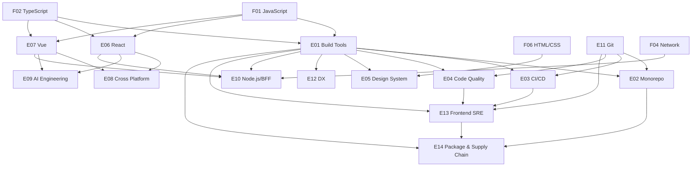
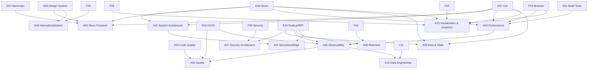
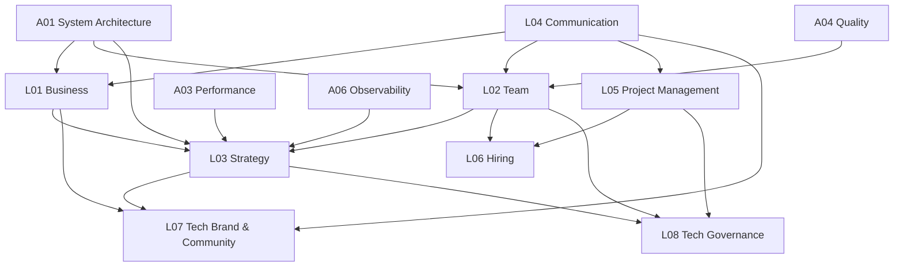

# 前端架构师知识依赖图

> 本文件用 Mermaid 图表展示 43 个知识领域之间的前置依赖关系，帮助学习者规划学习顺序。

---

## 使用说明

- **箭头方向**：`A --> B` 表示建议先学 A，再学 B。
- **实线箭头**：强依赖，必须先掌握。
- **虚线箭头**：弱依赖，有基础即可。
- 同一层内的领域可以并行学习。

---

## 一、全局四层依赖概览



---

## 二、Level 01 基础层内部依赖



**学习建议**：
- 先学 JavaScript，它是所有前端知识的根基。
- TypeScript 在 JavaScript 之后学。
- HTML/CSS 工程化与 Browser 相辅相成，可在 JavaScript 之后学习。
- Web 无障碍建立在语义化 HTML/CSS 基础上。
- 数据结构与算法和 JavaScript 紧密结合，可并行提升。
- 设计模式需要在有项目经验后学习，能更好理解其价值。
- Browser、Network、Security 可以并行学习，但 Security 需要 Network 和 Browser 的基础。

---

## 三、Level 02 工程化层内部依赖



**学习建议**：
- Build Tools 是工程化的入口，建议先学。
- React 和 Vue 可以二选一深入学习，另一个了解原理即可。
- Cross Platform、AI Engineering、Node.js/BFF 需要框架基础。
- Frontend SRE 需要 CI/CD、Code Quality、Build Tools 与 Git Workflow 基础。
- Package & Supply Chain 建立在 Build Tools、Monorepo 和 SRE 基础上。

---

## 四、Level 03 架构层内部依赖



**学习建议**：
- System Architecture 是架构层的入口。
- Performance 需要 Browser 和框架基础。
- Quality 需要 Code Quality 和 CI/CD 基础。
- Data & State 需要先理解框架状态和服务端交互。
- Observability 需要 Performance 和 CI/CD 基础。
- Security Architecture 需要 Web 安全与 Node.js/BFF 基础。
- Real-time 需要网络协议与 BFF 基础。
- Internationalization 需要 HTML/CSS 与设计体系基础。
- Visualization & Graphics 需要 JavaScript、Browser 和设计模式基础。
- Serverless/Edge 需要 Node.js/BFF 和系统架构基础。
- Data Engineering 需要可观测性和业务理解基础。

---

## 五、Level 04 领导力层内部依赖



**学习建议**：
- 领导力层需要扎实的架构基础。
- Business、Team、Communication 可以并行学习。
- Project Management 是团队协作和交付的通用能力。
- Hiring 建立在团队管理和组织发展基础上。
- Tech Brand & Community 依赖沟通、业务和战略能力。
- Tech Governance 是最高层管理能力，依赖战略、团队和项目管理。
- Strategy 是最高层技术能力，需要综合 Business、Team、Communication 和架构能力。

---

## 六、关键跨层依赖

| 依赖关系 | 说明 |
|----------|------|
| F01 JavaScript → E06/E07 React/Vue | 框架底层都是 JavaScript |
| F03 Browser → A03 Performance | 性能优化需要理解浏览器渲染 |
| F04 Network → E10 Node.js/BFF | BFF 需要网络协议基础 |
| E01 Build Tools → A03 Performance | 构建优化是性能的一部分 |
| E04 Code Quality → A04 Quality | 质量保障建立在代码质量基础上 |
| F05 Security → A07 Security Architecture | 安全架构需要基础安全知识 |
| F06 HTML/CSS → A09 Internationalization | 国际化需要理解 CSS 逻辑属性 |
| A01 System Architecture → L03 Strategy | 技术战略需要架构思维 |
| F08 Data Structures → A10 Visualization | 可视化需要算法和空间索引 |
| A06 Observability → A12 Data Engineering | 数据工程需要可观测性数据 |
| L01 Business → A12 Data Engineering | 数据工程服务于业务指标 |
| L04 Communication → L07 Tech Branding | 技术品牌依赖沟通和表达 |

---

## 七、推荐学习顺序（总体）

```
第一阶段（1-2 个月）：
F01 JavaScript → F02 TypeScript
（并行）F03 Browser、F04 Network、F05 Security、F06 HTML/CSS
F06 HTML/CSS → F07 a11y

第二阶段（2-3 个月）：
E01 Build Tools → E02 Monorepo、E03 CI/CD、E04 Code Quality
E11 Git Workflow → E02/E03/E04
E01 → E12 Developer Experience
（并行）E06 React 或 E07 Vue（选择一个深入）
E05 Design System

第三阶段（2-3 个月）：
E10 Node.js/BFF、E08 Cross Platform、E09 AI Engineering
A05 Data & State

第四阶段（2-3 个月）：
A01 System Architecture → A02 Micro Frontend、A03 Performance、A04 Quality、A06 Observability
F05 Security → A07 Security Architecture
F04 Network → A08 Real-time
F06 HTML/CSS → A09 Internationalization
F08 Data Structures → A10 Visualization
E10 Node.js/BFF → A11 Serverless/Edge
A06 Observability → A12 Data Engineering

第五阶段（持续）：
L01 Business、L02 Team、L03 Strategy、L04 Communication、L05 Project Management、L06 Hiring、L07 Tech Brand & Community、L08 Tech Governance
```

---

## 八、按职业方向的优先级

### 业务型前端架构师

高优先级：L01 Business、A01 System Architecture、A05 Data & State、E05 Design System、E10 Node.js/BFF

### 工程型前端架构师

高优先级：E01-E04、A03 Performance、A04 Quality、A06 Observability、E10 Node.js/BFF

### 平台型前端架构师

高优先级：E05 Design System、E08 Cross Platform、A02 Micro Frontend、E09 AI Engineering、E02 Monorepo

### 管理型前端技术负责人

高优先级：L02 Team、L03 Strategy、L01 Business、A01 System Architecture、A06 Observability

---

> **最后更新**：2026-06-25
