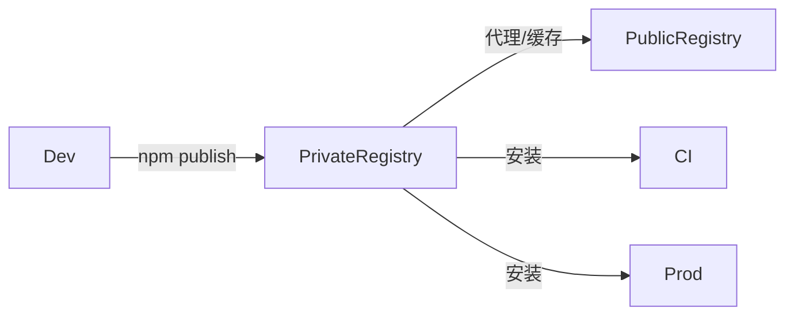

# E14 前端包管理与供应链安全

> 目标：掌握前端包管理原理、依赖治理和供应链安全防护，降低第三方依赖带来的风险。

---

## 核心要点（TL;DR）

- 现代前端项目依赖成百上千个 npm 包，包管理是工程化的基础能力。
- npm/yarn/pnpm 的依赖解析、安装、锁定机制各有差异。
- 供应链攻击（如恶意包、依赖混淆）已成为前端重大安全威胁。
- 依赖治理需要制度化：审批、审计、更新、替换、SBOM。
- lockfile 是构建可复现性的关键，必须纳入版本控制。
- pnpm 的严格 node_modules 结构和硬链接机制在安全性和磁盘效率上最优。
- 每个开发者都应对引入的依赖负责，安全不是仅靠工具就能解决的问题。

---

## 1. 包管理器原理

### 1.1 npm/yarn/pnpm 对比

| 特性 | npm | yarn | pnpm |
|------|-----|------|------|
| 安装速度 | 中等 | 快 | 最快 |
| 磁盘占用 | 大（每个项目独立 copy） | 大 | 小（全局 store + 硬链接/复制链接） |
| node_modules 结构 | 扁平（hoisted） | 扁平（hoisted） | 严格（嵌套 + 符号链接） |
| 幽灵依赖（phantom dependency） | 存在 | 存在 | 不存在 |
| pnp 模式（Plug'n'Play） | 不支持 | 支持（Yarn Berry） | 不支持 |
| workspace 支持 | 有（npm v7+） | 有 | 优秀（原生支持最完整） |
| lockfile 格式 | JSON（package-lock.json） | YAML（yarn.lock） | YAML（pnpm-lock.yaml） |
| 安装钩子（pre/postinstall） | 默认允许 | 默认允许 | 可配置 `pnpm.onlyBuiltDependencies` |
| 生命周期脚本管理 | 宽松 | 宽松 | 严格（可限制白名单） |
| 离线缓存 | 有 | 有（zero-installs） | 有（store + 全局缓存） |

#### 1.1.1 Hoisting 算法与幽灵依赖

**npm 和 yarn 的扁平化（hoisting）算法：**

传统 npm v2 使用嵌套结构，每个依赖有自己的 `node_modules`。npm v3+ 采用 hoisting 算法，试图将所有依赖提升到最顶层 `node_modules`，以符合 Node.js 模块解析规则。

hoisting 的过程本质上是一个 **拓扑排序问题**：

1. 解析 `package.json` 中声明的所有直接依赖及其版本范围。
2. 对每个依赖递归解析其传递依赖（transitive dependencies）。
3. 构建完整的依赖树，标记每个包的版本需求。
4. 进行 hoisting：尽可能将包提升到顶层 `node_modules`，如果版本冲突则保留嵌套副本。
5. 冲突处理：当两个依赖需要同一个包的不同版本时，将其中一个版本提升到顶层，另一个保留在 `node_modules/<parent>/node_modules/` 下。

**幽灵依赖（phantom dependencies）的形成原因：**

由于 npm/yarn 的扁平 hoisting，一个没有被 `package.json` 声明为直接依赖的包，可能因为被 hoisted 到顶层而可以被 `require()` 或 `import` 使用。这就是幽灵依赖。一旦某个上层包不再依赖该传递依赖，项目就会直接报错。

```js
// 没有在 package.json 声明过 left-pad
const leftPad = require('left-pad'); // 侥幸能跑，因为 A 包依赖了它
// 当 A 包升级不再需要 left-pad 后，这里就报错了
```

**pnpm 如何避免幽灵依赖：**

pnpm 不采用扁平结构，而是使用严格的 **嵌套 + 符号链接** 方案：
- 所有包的实际文件存储在全局 store 中。
- 项目 `node_modules` 以 `.pnpm` 目录为虚拟文件系统。
- 只有 `package.json` 中声明的直接依赖会出现在顶层 `node_modules` 中，且它们是到 `.pnpm` 目录中具体版本的符号链接。
- 包自身以及其传递依赖都放在 `.pnpm/<name>@<version>/node_modules/` 下。
- 因此，未声明的包不可访问，彻底消除了幽灵依赖。

pnpm 还提供 `--shamefully-hoist` 标志来模拟 npm 的扁平结构，用于迁移场景，但不建议在生产中使用。

#### 1.1.2 磁盘效率与全局 Store

pnpm 使用 **内容可寻址存储（content-addressable storage）** 的全局 store（通常位于 `~/.pnpm-store` 或 `~/.local/share/pnpm/store`），通过硬链接或复制链接将文件链接到项目。

- 同一个包的同一个版本在磁盘上只存一份。
- 不同项目可以共享相同的物理文件。
- 跨项目创建新项目时，如果依赖已缓存，安装几乎是瞬间完成的。
- Yarn Berry 的零安装（zero-installs）方案将缓存纳入 Git，适合 CI 但会增加仓库体积。

### 1.2 依赖解析算法

#### 1.2.1 SemVer 范围解析

npm 使用语义化版本（SemVer）来声明依赖范围。最常见的符号：

| 符号 | 含义 | 示例 | 匹配范围 |
|------|------|------|---------|
| `^` | 兼容大版本 | `^1.2.3` | `>=1.2.3 <2.0.0` |
| `~` | 兼容小版本 | `~1.2.3` | `>=1.2.3 <1.3.0` |
| `>=` | 大于或等于 | `>=1.2.3` | `>=1.2.3` |
| `*` | 任意版本 | `*` | 所有版本 |
| `1.x` | 通配 | `1.x` | `>=1.0.0 <2.0.0` |
| `>=1.2 <1.5` | 区间 | `>=1.2 <1.5` | 指定区间 |
| `1.2.3 - 1.5.0` | 范围 | `1.2.3 - 1.5.0` | `>=1.2.3 <=1.5.0` |

**解析策略：**

包管理器按照以下优先级进行版本解析：

1. **lockfile 优先**：如果 lockfile 中已有确切版本，且满足 `package.json` 中声明的范围，则直接使用 lockfile 中的版本。
2. **registry 查询**：如果没有 lockfile 或 lockfile 条目不满足范围，则查询 registry 获取满足范围的最新版本。
3. **最小化升级**：在满足范围的前提下，倾向使用已安装的版本，最小化变化。
4. **确定性哈希**：npm v7+ 的 lockfile v2/v3 通过 `integrity` 字段确保包内容的完整性。

#### 1.2.2 Lockfile 生成机制

**npm `package-lock.json`：**

```json
{
  "name": "my-project",
  "lockfileVersion": 3,
  "packages": {
    "node_modules/lodash": {
      "version": "4.17.21",
      "resolved": "https://registry.npmjs.org/lodash/-/lodash-4.17.21.tgz",
      "integrity": "sha512-v2kDEe57lecTulaDIuNTPy3Ry4gLGJ6Z1O3vE1krgXZNrsQ+LFTGHVxVjcXPs17LhbZVGedAJv8XZ1tvj5FvSg==",
      "dev": true
    }
  }
}
```

- `lockfileVersion`: lockfile 格式版本（1=旧版，2=v7 兼容，3=严格模式）。
- `packages`: 完整的包依赖映射，包括所有传递依赖。
- `integrity`: 基于 SHA-512 的 Subresource Integrity 哈希，用于验证包内容未被篡改。

**yarn.lock：**

```
lodash@^4.17.21:
  version "4.17.21"
  resolved "https://registry.yarnpkg.com/lodash/-/lodash-4.17.21.tgz#..."
  integrity sha512-v2kDe57lecTulaDIuNTPy3Ry4gLGJ6Z1O3vE1kr...
```

Yarn 的 lockfile 使用 `@` 语法列出所有满足某个范围的确切版本。

**pnpm-lock.yaml：**

```yaml
packages:
  /lodash/4.17.21:
    resolution: {integrity: sha512-v2kDEe57lecTulaDIuNTPy3Ry4gLGJ6Z1O3vE1krgXZNrsQ...}
    dev: true
```

pnpm 采用扁平化的包列表，每个条目由包名和版本唯一标识，避免了版本冲突时的冗余条目。

#### 1.2.3 版本冲突解决

当依赖树中出现版本冲突时，不同包管理器采用不同策略：

- **npm/yarn**：将满足多个消费者需要的最高兼容版本提升到顶层，较低版本嵌套在消费者目录下。
- **pnpm**：每个包都精确使用其声明依赖的版本，不进行 hoisting。如果 A 依赖 `lodash@4.0` 而 B 依赖 `lodash@4.17`，则 A 看到 `lodash@4.0`，B 看到 `lodash@4.17`，互不干扰。
- **Yarn Berry（PnP）**：使用 `yarn.lock` 中的确切版本，通过 `.pnp.cjs` 文件直接映射模块位置，无需 `node_modules`。

### 1.3 Lockfile 最佳实践

| 实践 | 说明 |
|------|------|
| 始终提交 lockfile | 确保所有环境和 CI 使用相同版本 |
| 审查 lockfile diff | 依赖变更应当经 Code Review |
| 定期 `npm audit` | 基于 lockfile 扫描已知漏洞 |
| 不要手动编辑 lockfile | 使用 `npm install` 等命令自动更新 |
| 使用 `--frozen-lockfile` | CI 中不允许 lockfile 变化 |
| 升级依赖后清理 | `npm dedupe` 减少冗余 |

---

## 2. 依赖治理

### 2.1 依赖评估

引入第三方依赖前应进行多维度的评估，避免盲目添加。

**评估维度矩阵：**

| 维度 | 检查项 | 权重 |
|------|--------|------|
| 社区活跃度 | GitHub stars、最近 commit 时间、release 频率 | 高 |
| 维护者信息 | 维护者数量、是否组织维护 | 高 |
| issue 管理 | 未关闭 issue 数量、平均响应时间 | 中 |
| 包体积 | 安装后大小、是否含多余文件 | 中 |
| 传递依赖数量 | 间接依赖总数、依赖树深度 | 高 |
| 许可协议 | 是否兼容项目许可 | 高 |
| 安全性 | 历史 CVE 数量、安全策略文件 | 高 |
| 替代方案 | 是否有标准库 / 更轻量替代 | 中 |
| 浏览器兼容性 | 是否支持目标浏览器 | 低 |
| TypeScript 支持 | 是否内置类型声明 | 低 |

**量化评估示例：**

```bash
# 查看包信息
npm view <package-name>

# 查看包大小对比
npx bundlejs <package-name>

# 分析依赖树
npm ls --all

# 查看历史版本
npm view <package-name> versions --json

# 查看包的依赖数量
npm info <package-name> dependencies

# 分析包的传递依赖
npx npm-remote-ls <package-name>
```

### 2.2 依赖审计

#### 2.2.1 npm audit

```bash
# 基础审计
npm audit

# JSON 格式输出，适合 CI 解析
npm audit --json

# 只报告 high 以上级别
npm audit --audit-level=high

# 自动修复（可能引入 breaking changes）
npm audit fix

# 只修复 patch 版本
npm audit fix --force

# 生成审计报告
npm audit --report
```

**audit 输出解读：**

| 字段 | 说明 |
|------|------|
| severity | 严重程度：critical / high / moderate / low |
| vulnerable_versions | 受影响的版本范围 |
| patched_versions | 修复版本 |
| path | 攻击路径（依赖链） |
| cwe | CWE 分类编号 |
| cvss | CVSS 评分（通常 0-10） |
| advisory | 安全公告 URL |

#### 2.2.2 自动化审计工具对比

| 工具 | 类型 | 集成方式 | 特点 |
|------|------|---------|------|
| npm audit | 内置 | CLI / CI | 免费，但覆盖有限 |
| Snyk | 商业 | CLI / GitHub / CI | 覆盖广，修复建议，策略引擎 |
| Dependabot | SaaS | GitHub 原生 | 自动提 PR，配置简单 |
| Renovate | 开源 | 自托管 / GitHub App | 高度可配置，分组策略 |
| OSV-Scanner | 开源 | CLI / CI | Google 维护，免费 |
| Socket.dev | 商业 | CLI / GitHub App | 检测恶意包、混淆攻击 |
| Grype | 开源 | CLI / CI | Anchore 出品，SBOM 集成 |

#### 2.2.3 漏洞修复 SLA

建议企业建立以下 SLA 策略：

| 严重级别 | 响应时间 | 修复时间 | 示例 |
|---------|---------|---------|------|
| Critical | 4 小时 | 24 小时 | 远程代码执行（RCE） |
| High | 24 小时 | 72 小时 | 敏感数据泄露 |
| Medium | 1 周 | 2 周 | XSS（有前置条件） |
| Low | 1 个月 | 1 季度 | 理论攻击向量 |

### 2.3 依赖升级

#### 2.3.1 升级策略

| 策略 | 方法 | 风险 | 适用场景 |
|------|------|------|---------|
| 固定版本 | 不声明范围，锁定确切版本 | 最高安全风险 | 生产级严格项目 |
| 波浪号 `~` | 允许 patch 升级 | 低 | 成熟稳定库 |
| 插入号 `^` | 允许 minor 升级 | 中 | 大部分场景 |
| 宽松范围 | 允许 major 升级 | 高 | 开发依赖、实验项目 |
| 精确锁定 | lockfile + `^` 范围 | 低 | 推荐策略 |

#### 2.3.2 Renovate / Dependabot 配置

**Dependabot 配置示例（`.github/dependabot.yml`）：**

```yaml
version: 2
updates:
  - package-ecosystem: "npm"
    directory: "/"
    schedule:
      interval: "weekly"
      day: "monday"
    open-pull-requests-limit: 10
    labels:
      - "dependencies"
      - "automerge"
    versioning-strategy: increase
    ignore:
      - dependency-name: "react"
        versions: [">=18.0.0"]
```

**Renovate 配置示例（`.github/renovate.json`）：**

```json
{
  "extends": ["config:base"],
  "packageRules": [
    {
      "matchUpdateTypes": ["patch"],
      "automerge": true
    },
    {
      "matchDepTypes": ["devDependencies"],
      "automerge": true
    },
    {
      "matchPackageNames": ["react", "react-dom"],
      "enabled": false
    }
  ],
  "schedule": ["before 9am on monday"]
}
```

### 2.4 私有仓库

#### 2.4.1 私有 Registry 方案对比

| 方案 | 类型 | 部署方式 | 特点 |
|------|------|---------|------|
| Verdaccio | 开源 | 自部署（Docker） | 轻量，配置灵活，支持代理 |
| Nexus Repository | 商业/免费 | 自部署 | 成熟，支持多格式（npm/Maven/PyPI） |
| Artifactory | 商业 | 自部署/SaaS | 企业级，高可用，SSO |
| GitHub Packages | SaaS | GitHub 集成 | 零运维，但只能与 GitHub 搭配 |
| AWS CodeArtifact | SaaS | AWS 集成 | 与 IAM 集成，VPC 友好 |

**Verdaccio 快速部署：**

```bash
# Docker 部署
docker run -d --name verdaccio -p 4873:4873 verdaccio/verdaccio

# 配置 npm registry
npm set registry http://localhost:4873/

# 添加用户并发布
npm adduser --registry http://localhost:4873/
npm publish --registry http://localhost:4873/

# 配置作用域映射
npm config set @my-company:registry http://localhost:4873/
```

**作用域包（scoped packages）最佳实践：**

- 公共包和私有包使用不同的作用域：`@company-public/` vs `@company-internal/`
- 在 `.npmrc` 中为私有作用域配置单独的 registry
- 发布时使用 `--access restricted` 确保包不被意外公开

#### 2.4.2 包发布工作流



**发布前检查清单：**

- [ ] 版本号是否正确（遵循 SemVer）
- [ ] `package.json` 中 `private: false`
- [ ] `files` 字段排除了不需要的文件
- [ ] 包含 README、LICENSE
- [ ] 构建产物已生成
- [ ] 测试通过
- [ ] Changelog 已更新
- [ ] `npm pack --dry-run` 确认发布内容

**npm provenance（包来源证明）：**

```bash
# 在 CI 中发布带来源证明的包
npm publish --provenance
```

npm v9+ 支持包来源证明，使用 Sigstore 协议：
- 在 GitHub Actions CI 中运行时，npm 会自动生成 provenance 签名。
- 该签名由 GitHub OIDC token 签发，证明包是从特定的 Git 仓库和 CI 流水线发布的。
- 消费者可以通过 `npm audit --attestations` 验证包来源。

---

## 3. 供应链安全

### 3.1 常见攻击类型

| 攻击类型 | 说明 | 真实案例 | 防护手段 |
|----------|------|---------|---------|
| 恶意包植入后门 | 攻击者向正常包中注入恶意代码 | event-stream（2018） | 审计、沙箱、来源审查 |
| 依赖混淆（Dependency Confusion） | 上传与内部私有包同名的公共包到 npm | 多个大厂内部包名被注册（2021） | 作用域、私有 registry、`engine-strict` |
| 版本劫持 | 攻击者取得包维护者账号，发布恶意版本 | eslint-scope（2018） | 2FA/锁版本/签名验证 |
| Typosquatting（抢注相似名） | 注册与知名包仅差一两个字母的包名 | cross-env vs crossenv（多种变体） | 安装前核对包名 |
| Protestware / 抗议软件 | 维护者出于政治目的植入破坏性代码 | node-ipc（2022，写入恶意文件） | 锁版本、审查更新 |
| 依赖混淆（软件仓库） | 攻击者利用系统优先级安装恶意包 | pip / npm 混合安装 | 配置 registry 优先级 |
| 社会工程攻击 | 冒充维护者骗取权限 | eslint maintainer（2020） | 2FA、组织审核 |

#### 3.1.1 重大 CVE 案例深度分析

**1. event-stream 后门事件（CVE-2018-16487）**

事件经过：
- `event-stream` 是一个非常流行的 npm 包（周下载量 200 万+），用于处理 Node.js 流。
- 2018 年 9 月，原维护者将包所有权转让给一个之前不活跃的贡献者。
- 新维护者在 `flatmap-stream` 依赖中嵌入了恶意代码，专门针对 Copay（比特币钱包）窃取私钥。
- 恶意代码在数千个项目中运行了约 2 个月后才被发现。

教训：
- 包所有权转让需格外警惕。
- 传递依赖（transitive dependencies）同样需要审计。
- 引入新依赖或维护者变更时应当审查 diff。

**2. ua-parser-js 恶意版本（CVE-2021-32648）**

事件经过：
- `ua-parser-js` 是广泛使用的 User-Agent 解析库。
- 2021 年 10 月，维护者账号被劫持，发布了带有恶意挖矿软件的 0.7.29 / 0.8.0 / 1.0.0 版本。
- 恶意代码下载安装了木马程序。
- 发布后数小时内被 npm 安全团队移除。

教训：
- lockfile 能阻止自动升级到恶意版本。
- 维护者应启用 2FA 认证。
- 监控 npm 安全公告。

**3. node-ipc protestware（2022 年 3 月）**

事件经过：
- `node-ipc` 包的维护者（@RIAEvangelist）在 10.1.1 和 10.1.2 版本中植入了恶意代码。
- 如果检测到受害者位于俄罗斯或白俄罗斯的 IP 地址，代码会尝试删除系统中的所有文件（所谓的"抗议软件"）。
- 由于 `vue-cli` 和其他工具链依赖了 `node-ipc` 作为传递依赖，大量开发者的 CI 和本地环境受到影响。

教训：
- 依赖升级应当经过 Code Review 和回归测试。
- 对于阻止型（denial of service）的 protestware，快速封锁版本即可缓解。
- 使用 `overrides` 或 `resolutions` 锁定受影响包的安全版本。

**4. colors.js / faker.js 事件（CVE-2022-24785，2022 年 1 月）**

事件经过：
- 维护者 Marak 出于愤怒（未被大公司资助），在 `colors@1.4.1` 和 `faker@6.6.6` 中引入了死循环和乱码输出。
- 影响面极广，大量 Node.js 项目因此崩溃。
- 这是 protestware 的另一个典型案例 - 维护者将代码开源工具作为抗议方式。

教训：
- 核心基础设施（infrastructure）包的风险。
- 需要建立关键依赖的镜像或缓存机制。
- 依赖多样性：不要过度集中在少数维护者手中。

**5. eslint-scope 版本劫持（2018 年 7 月）**

事件经过：
- eslint-scope 3.7.2 被劫持发布，包含恶意代码泄露 `.npmrc` 中的认证 token。
- 这是攻击者获取了 eslint 维护者的 npm 账号后发布的。
- 影响众多企业级项目。

教训：
- 所有 npm 账号必须启用 2FA。
- 建议组织使用 MFA token 而非密码登录。

### 3.2 安全实践

#### 3.2.1 固定版本 + Lockfile

```bash
# 安装时生成 lockfile 并锁定确切版本
npm install --save-exact react

# CI 中使用 frozen lockfile 确保一致性
npm ci --frozen-lockfile

# yarn 对应
yarn install --frozen-lockfile

# pnpm 对应
pnpm install --frozen-lockfile
```

#### 3.2.2 使用私有 Registry 和 Scoped Packages

```bash
# 为私有作用域配置专用 registry
npm config set @company-internal:registry https://npm.company.com/

# 安装时避免公共 registry 上的混淆攻击
npm install @company-internal/sdk
```

#### 3.2.3 最小权限原则

```json
// .npmrc 或 pnpm 配置
{
  "pnpm": {
    "onlyBuiltDependencies": ["core-js", "sharp"]
  }
}
```

通过限制生命周期脚本的执行，可以阻止恶意包在 `postinstall` 阶段执行攻击代码：

```bash
# npm 忽略所有生命周期脚本
npm install --ignore-scripts

# 然后再执行必要包的脚本
npx only-allow pnpm
```

#### 3.2.4 生成 SBOM（软件物料清单）

```bash
# 使用 npm 生成 SBOM（npm v10+）
npm sbom

# 使用 CycloneDX 格式
npm sbom --format=cyclonedx

# 使用 SPDX 格式
npm sbom --format=spdx

# 使用第三方工具生成更完整的 SBOM
npx @cyclonedx/bom
```

**SBOM 的核心价值：**

- **漏洞响应**：当新 CVE 披露时，快速定位受影响项目
- **合规审计**：满足 SOC2、ISO 27001 等合规要求
- **许可证合规**：自动检测许可证冲突
- **依赖追踪**：可视化整个依赖树

**SBOM 内容示例（CycloneDX 格式）：**

```json
{
  "bomFormat": "CycloneDX",
  "specVersion": "1.4",
  "components": [
    {
      "type": "library",
      "name": "lodash",
      "version": "4.17.21",
      "purl": "pkg:npm/lodash@4.17.21",
      "licenses": [{"license": {"id": "MIT"&#125;&#125;]
    }
  ]
}
```

#### 3.2.5 代码签名与完整性验证

- **Subresource Integrity (SRI)**：在前端 HTML 中通过 `integrity` 属性确保 CDN 内容的完整性。
- **npm integrity 字段**：lockfile 中的 `integrity` 字段使用 SHA-512 对包内容进行校验。
- **Provenance 验证**：`npm audit --attestations` 验证包的来源证明。
- **Sigstore 生态**：使用 Sigstore 的无密钥签名方案（keyless signing）。

```html
<!-- HTML 中的 SRI 使用示例 -->
<script src="https://cdn.example.com/lib.js"
        integrity="sha384-ABC123..."
        crossorigin="anonymous"></script>
```

### 3.3 Lockfile 完整性与安全检查清单

```bash
# 1. Lockfile 格式验证
npm ls --all 2>&1 | head -20

# 2. 检查 lockfile 是否最新
npm install --dry-run

# 3. 锁定文件完整性检查
npm ci --frozen-lockfile

# 4. 完整的安全审计
npm audit --json | npx audit-ci --config audit-ci.json

# 5. 检查过期依赖
npm outdated

# 6. 检查传递依赖中的已知恶意包
npm audit --registry=https://registry.npmjs.org

# 7. 生成的 SBOM
npm sbom


## 4. 供应链安全实战

> 本节提供从零开始的分步骤安全加固指南，适用于团队或组织快速落地供应链安全方案。

### 4.1 初级阶段（1-2 周完成）

**目标：消除最明显的安全隐患**

| 步骤 | 操作 | 命令 / 配置 |
|------|------|-------------|
| 1.1 | 提交 lockfile 到版本库 | 确保 git 未忽略 lockfile |
| 1.2 | 配置 CI 使用 --frozen-lockfile | npm ci --frozen-lockfile |
| 1.3 | 运行初始审计并修复已知漏洞 | npm audit fix |
| 1.4 | 检查所有包名是否与公共包冲突 | npm view <package-name> |
| 1.5 | 为 npm 账号启用 2FA | npm profile enable-2fa auth-and-writes |
| 1.6 | 配置 .npmrc 暴露最小 token | //registry.npmjs.org/:_authToken=${NPM_TOKEN} |

**CI 安全配置模板：**


### 4.2 中级阶段（1-2 个月完成）

**目标：建立制度化的安全检查**

| 步骤 | 操作 | 说明 |
|------|------|------|
| 2.1 | 引入 Dependabot 或 Renovate | 自动扫描和更新依赖 |
| 2.2 | 建立依赖评审流程 | 新增依赖需两人评审 |
| 2.3 | 配置 Snyk 或 Socket.dev | 深度安全扫描 |
| 2.4 | 使用私有 Registry | 缓存和代理公共包 |
| 2.5 | 限制安装脚本执行 | pnpm.onlyBuiltDependencies |
| 2.6 | 生成并归档 SBOM | 每次发布附带 SBOM |

**依赖评审 Checklist（PR 模板）：**


### 4.3 高级阶段（持续）

**目标：全生命周期安全管理**

| 步骤 | 操作 | 说明 |
|------|------|------|
| 3.1 | 实施依赖许可证合规 | 自动检测许可证冲突 |
| 3.2 | 建立 CVE 应急响应流程 | 定义漏洞发现后的处理路径 |
| 3.3 | 实施构建可复现性验证 | 确保每次构建产生相同产物 |
| 3.4 | 定期渗透测试 | 包括供应链攻击场景 |
| 3.5 | 安全培训 | 全员供应链安全意识培训 |
| 3.6 | 供应商评估 | 对关键依赖的上游进行安全评估 |

### 4.4 紧急响应流程

当发现依赖中存在严重安全漏洞时，遵循以下流程：

```
发现漏洞
   ↓
确认影响范围（受影响的包、版本、自己的项目）
   ↓
评估严重性（CVSS 评分）
   ↓
[Critical/High]      [Medium/Low]
   ↓                      ↓
立即修复               排入常规迭代
   ↓                      ↓
更新 lockfile           更新依赖
强制覆盖版本             正常发布
   ↓
通知相关团队
   ↓
更新 SBOM
   ↓
事故复盘
```

**快速覆盖漏洞版本的方法：**

```json
// package.json 中使用 overrides（npm v8+）
{
  "overrides": {
    "semver-regex": "3.1.4",
    "glob-parent": "6.0.2",
    "node-ipc": "10.1.0"
  }
}
```

```json
// yarn 使用 resolutions
{
  "resolutions": {
    "semver-regex": "3.1.4"
  }
}
```

```json
// pnpm 使用 overrides
{
  "pnpm": {
    "overrides": {
      "semver-regex@<3.1.4": "3.1.4"
    }
  }
}
```

---

## 5. 依赖治理制度

> 建立组织级别的依赖管理政策和流程，将供应链安全融入开发文化。

### 5.1 组织策略框架

```
+---------------------------------------------+
|           依赖治理制度                       |
+------------------+---------------------------+
| 政策层面          | 流程层面                  |
+------------------+---------------------------+
| 依赖引入政策      | 新增依赖审批流程           |
| 许可合规政策      | 漏洞响应流程               |
| 版本管理政策      | 定期审计流程               |
| 私有Registry      | 废弃替换流程               |
| 风险管理政策      | 季度评估流程               |
+------------------+---------------------------+
```

### 5.2 核心制度条款

#### 条款一：依赖引入审批

所有新引入的第三方依赖必须经过以下审批流程：

1. 开发者填写《新增依赖申请表》（GitHub Issue 模板）。
2. 技术负责人评估必要性（是否有标准库替代、是否重复）。
3. 安全团队审查安全风险（历史 CVE、维护者背景、许可证）。
4. 架构团队确认对系统架构的影响。
5. 审批通过后在项目 Wiki 中登记。

**依赖引入评分卡：**

| 指标 | 优秀（3分） | 合格（1分） | 不合格（0分） |
|------|-----------|-----------|------------|
| GitHub Stars | > 10000 | > 1000 | < 1000 |
| 最近更新 | < 1 个月 | < 6 个月 | > 1 年 |
| 传递依赖数 | < 10 | < 30 | > 30 |
| 许可证 | MIT / Apache 2.0 | BSD / ISC | GPL / AGPL |
| CVE 历史 | 无 | 已修复 | 有未修复 CVE |
| 维护者数 | > 5 | > 2 | 单人维护 |

> **准入阈值**：总分 >= 10 方可引入，低于 10 分需管理层特批。

#### 条款二：定期审计制度

| 频率 | 审计内容 | 责任人 |
|------|---------|--------|
| 每周 | Dependabot 自动扫描 PR | 开发团队 |
| 每月 | 全量 npm audit + 生成报告 | 安全团队 |
| 每季度 | SBOM 更新 + 许可证合规审查 | 安全架构师 |
| 每半年 | 关键依赖的健康度评估 | 技术委员会 |
| 每年 | 外部安全审计 + 渗透测试 | 第三方安全公司 |

#### 条款三：漏洞响应 SLA

参见上文 2.2.3 节中的漏洞修复 SLA 表格。除此之外，补充：

- **Critical 漏洞**：由安全负责人组建应急小组，每小时同步进展。
- **通讯渠道**：内部安全公告 Slack 频道，所有依赖变更需要广播通知。
- **回滚机制**：如有问题的更新已发布，记录回滚步骤和时间线。

#### 条款四：废弃依赖管理

依赖不再需要时，应当正式废弃并记录：

1. 确认所有代码中不再引用该依赖。
2. 检查传递依赖是否还依赖它（npm ls <package>）。
3. 从 package.json 中移除。
4. 确保在 CI 和构建环境中也移除了。
5. 在项目文档中记录移除原因。
6. 更新 SBOM 和依赖清单。

### 5.3 许可合规管理

#### 5.3.1 开源许可证分类

| 类别 | 许可证 | 特点 | 商用注意事项 |
|------|--------|------|------------|
| 宽松（Permissive） | MIT、Apache 2.0、BSD | 几乎无限制可自由使用 | 推荐，风险最低 |
| 弱 Copyleft | LGPL、MPL | 修改此库需开源，使用时无需 | 可作为库链接使用 |
| 强 Copyleft | GPL、AGPL | 衍生作品必须开源 | 商业软件应避免 |
| 专有/非标准 | Commons Clause | 有限制条件 | 需法务评估 |

**许可证兼容性矩阵：**

| 你的许可证 | MIT | Apache 2.0 | GPLv3 | LGPLv3 | AGPLv3 |
|-----------|-----|-----------|-------|--------|--------|
| MIT | Y | Y | Y | Y | N |
| Apache 2.0 | Y | Y | Y | Y | N |
| GPLv3 | Y | N（专利条款冲突） | Y | Y | Y |
| Proprietary | Y | Y | N | N | N |

#### 5.3.2 许可证检查工具

```bash
# 使用 license-checker 检查项目依赖许可证
npx license-checker --summary

# 检查并排除 GPL 许可
npx license-checker --exclude 'MIT, Apache-2.0, BSD*'

# 生成许可证报告
npx license-checker --csv --out licenses.csv
```

**CI 集成许可证检查：**

```yaml
# .github/workflows/license-check.yml
name: License Check
on: [pull_request]
jobs:
  check:
    runs-on: ubuntu-latest
    steps:
      - uses: actions/checkout@v4
      - uses: actions/setup-node@v4
      - run: npm ci
      - run: npx license-checker --failOn 'GPL*'
```

---


---

## 6. Monorepo 中的依赖管理

### 6.1 Workspace 协议（Workspace Protocol）

现代包管理器支持 workspace 协议，通过 `workspace:` 前缀声明对 monorepo 中其他 workspace 包的依赖：

```json
{
  "name": "@my-app/web",
  "dependencies": {
    "@my-app/shared": "workspace:*",
    "@my-app/utils": "workspace:^1.0.0"
  }
}
```

发布时包管理器会自动将 workspace 协议转换为实际版本号（例如 `workspace:^1.0.0` → `^1.0.0`）。

**协议说明：**

| 协议 | 含义 | 场景 |
|------|------|------|
| `workspace:*` | 匹配本地最新版本 | 开发模式 |
| `workspace:^` | 匹配兼容本地版本 | 库之间 |
| `workspace:~` | 匹配精确本地版本 | 严格协作 |

### 6.2 Workspace Hoisting 策略

| 策略 | 说明 | 适用场景 |
|------|------|---------|
| 升顶（hoist） | 共同依赖提升到根 node_modules | 默认，节省空间 |
| 严格（isolated） | 每个包独立安装 | 严格隔离，安全 |
| 混合 | 部分提升，部分隔离 | 自定义控制 |

### 6.3 版本一致性策略

| 策略 | 优点 | 缺点 | 工具 |
|------|------|------|------|
| 统一版本 | 简单、一致 | 升级波动大 | 根目录 package.json |
| 独立版本 | 灵活、隔离 | 可能版本膨胀 | Lerna |
| Sync 工具 | 自动同步版本 | 额外工具链 | syncpack、manypkg |

### 6.4 Changesets 管理

```bash
npx changeset init
npx changeset
npx changeset version
npx changeset publish
```

### 6.5 避免循环依赖

```bash
# 使用 madge 检测循环依赖
npx madge --circular packages/
# 使用 dpdm 分析 ES Module 循环引用
npx dpdm --circular packages/web/src/index.ts
# 依赖图可视化
npx madge --image graph.png packages/
```

**预防原则：**
- 保持层次结构清晰：shared → utils → features → apps（单向依赖）。
- 不允许底层包引用上层包。
- 在 CI 中添加循环依赖检测步骤。

---

## 7. Package.json 字段深度解析

### 7.1 `exports` 字段

```json
{
  "exports": {
    ".": {
      "import": "./dist/index.mjs",
      "require": "./dist/index.cjs",
      "types": "./dist/index.d.ts"
    },
    "./utils": {
      "import": "./dist/utils.mjs",
      "require": "./dist/utils.cjs"
    }
  }
}
```

**关键特性：** 子路径导出、条件导出、防止私有模块泄露。

### 7.2 `types` 和 `typings`

```json
{ "types": "./dist/index.d.ts", "typesVersions": { ">=4.2": { "*": ["./dist/ts4.2/*"] } } }
```

### 7.3 `sideEffects`

```json
{ "sideEffects": ["./dist/side-effect.js", "*.css"] }
```

- 告诉打包工具哪些文件有副作用。
- `sideEffects: false` 启用 tree-shaking。

### 7.4 `peerDependencies` 和 `peerDependenciesMeta`

```json
{
  "peerDependencies": { "react": "^17.0.0 || ^18.0.0" },
  "peerDependenciesMeta": { "react-dom": { "optional": true } }
}
```

### 7.5 `overrides` 和 `resolutions`

```json
{
  "overrides": { "semver-regex": "3.1.4", "glob-parent": "6.0.2" }
}
```

**注意事项：**
- `overrides` 应作为临时措施，长期应推动上游依赖更新。
- yarn 使用 `resolutions`，pnpm 在 `pnpm.overrides` 中配置。

### 7.6 `engines` 和 `engineStrict`

```json
{ "engines": { "node": ">=18.0.0", "pnpm": ">=8.0.0" }, "engineStrict": true }
```

---

## 8. 构建可复现性（Reproducible Builds）

### 8.1 为什么需要可复现性

- **安全性**：确保 CI 和本地构建产生完全相同的产物。
- **可审计性**：每次发布都可追溯到确切源码和依赖版本。
- **合规性**：金融、医疗等行业监管要求构建可复现。

### 8.2 实现可复现的关键要素

| 要素 | 做法 | 工具/配置 |
|------|------|---------|
| 锁定的依赖版本 | 提交 lockfile，使用 --frozen-lockfile | lockfile |
| 固定的包管理器版本 | 使用 packageManager 字段 | Corepack |
| 不变的源码 | 基于 Git tag 构建 | Git |
| 确定的构建产物 | 消除时间戳、路径等不确定因素 | 构建工具配置 |
| 环境隔离 | Docker 容器构建 | Dockerfile |
| 离线缓存 | 使用构建缓存，不打远程请求 | pnpm store |

### 8.3 Corepack

```json
{ "packageManager": "pnpm@8.15.0+sha256.xxxxxxxx" }
```

- Corepack 是 Node.js 内置的包管理器版本管理器。
- 确保所有开发者使用完全相同的包管理器版本。

### 8.4 Hermetic Build（密封构建）

```yaml
FROM node:20-alpine AS builder
WORKDIR /app
COPY package.json pnpm-lock.yaml ./
RUN corepack enable && pnpm install --frozen-lockfile
COPY . .
RUN pnpm build
```

**可复现性检查：**

```bash
npm install --dry-run
cp -r dist dist1 && pnpm build && diff -r dist dist1
```

---

## 常见误区

| 误区 | 正确理解 |
|------|---------|
| 直接 copy 网上的安装命令 | 应核对包名、版本和来源 |
| lockfile 不需要提交 | lockfile 是构建可复现的关键 |
| 只要功能正常就不用升级 | 旧依赖可能存在安全漏洞 |
| 供应链安全只靠安全团队 | 每个开发者都应有安全意识 |
| 开源包都是安全的 | 开源包也可能被植入后门 |
| lockfile 能避免所有漏洞 | lockfile 只锁定版本，不防漏洞 |
| 用 yarn 就比 npm 更安全 | 安全性取决于配置和习惯 |
| 老版本更稳定 | 老版本可能包含未修复的漏洞 |
| 只观察直接依赖就够了 | 传递依赖同样需要审计 |
| CI 通过了就没问题 | CI 只检查能检测到的已知漏洞 |

---

## 相关领域

- E02 Monorepo：工作区依赖管理。
- E03 CI/CD：自动化审计和安装。
- A07 Security Architecture：安全架构纵深。
- F05 Security：基础 Web 安全。

---

## 扩展阅读

- [npm 官方文档 - Security](https://docs.npmjs.com/cli/v10/configuring-npm/package-json)
- [pnpm 官方文档 - Workspace](https://pnpm.io/workspaces)
- [OWASP Dependency Check](https://owasp.org/www-project-dependency-check/)
- [CycloneDX SBOM 标准](https://cyclonedx.org/)
- [Sigstore - 软件签名](https://www.sigstore.dev/)
- [Snyk 供应链安全报告](https://snyk.io/reports/)
- [GitHub Advisory Database](https://github.com/advisories)

---

**标签**：`#package-management` `#supply-chain` `#security` `#monorepo`

> **最后更新**：2026-07-06


---

## 本领域学习进度

<MarkComplete domainId="package-supply-chain" />
<ProgressTracker />
