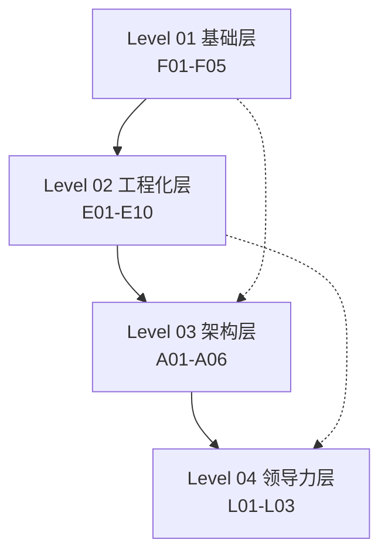
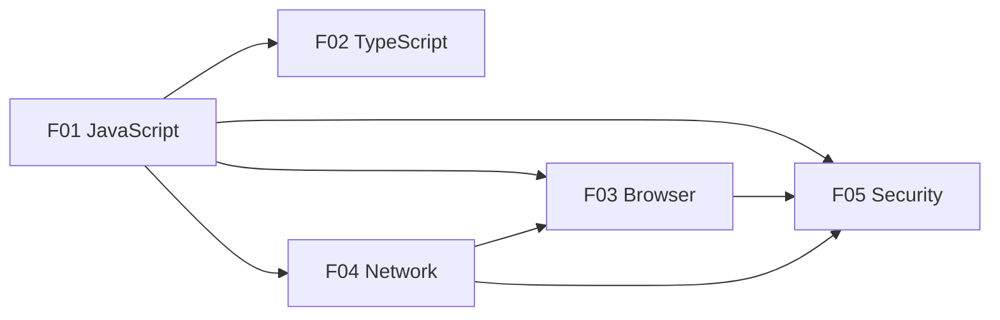
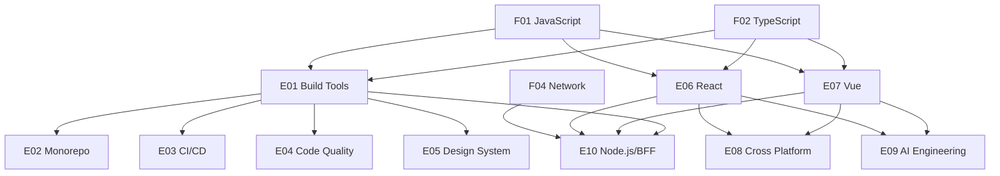
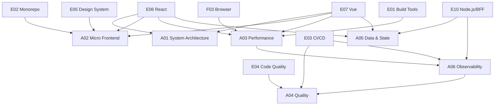
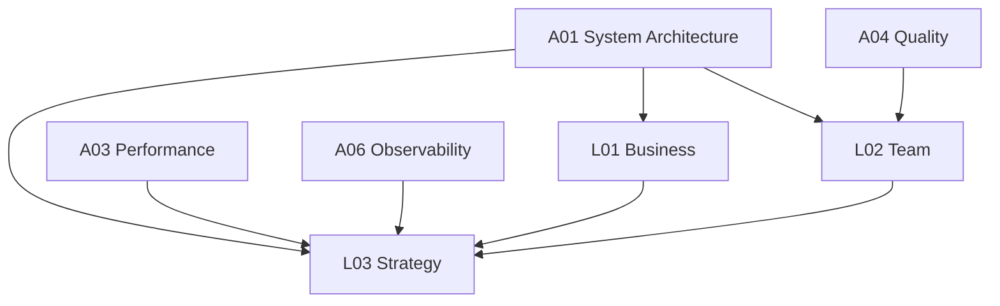

# 前端架构师知识依赖图

> 本文件用 Mermaid 图表展示 24 个知识领域之间的前置依赖关系，帮助学习者规划学习顺序。

<KnowledgeGraph />

---

## 使用说明

- **箭头方向**：`A --> B` 表示建议先学 A，再学 B。
- **实线箭头**：强依赖，必须先掌握。
- **虚线箭头**：弱依赖，有基础即可。
- 同一层内的领域可以并行学习。

---

## 一、全局四层依赖概览



---

## 二、Level 01 基础层内部依赖



**学习建议**：
- 先学 JavaScript，它是所有前端知识的根基。
- TypeScript 在 JavaScript 之后学。
- Browser、Network、Security 可以并行学习，但 Security 需要 Network 和 Browser 的基础。

---

## 三、Level 02 工程化层内部依赖



**学习建议**：
- Build Tools 是工程化的入口，建议先学。
- React 和 Vue 可以二选一深入学习，另一个了解原理即可。
- Cross Platform、AI Engineering、Node.js/BFF 需要框架基础。

---

## 四、Level 03 架构层内部依赖



**学习建议**：
- System Architecture 是架构层的入口。
- Performance 需要 Browser 和框架基础。
- Quality 需要 Code Quality 和 CI/CD 基础。
- Data & State 需要先理解框架状态和服务端交互。
- Observability 需要 Performance 和 CI/CD 基础。

---

## 五、Level 04 领导力层内部依赖



**学习建议**：
- 领导力层需要扎实的架构基础。
- Business 和 Team 可以并行学习。
- Strategy 是最高层，需要综合 Business、Team 和架构能力。

---

## 六、关键跨层依赖

| 依赖关系 | 说明 |
|----------|------|
| F01 JavaScript → E06/E07 React/Vue | 框架底层都是 JavaScript |
| F03 Browser → A03 Performance | 性能优化需要理解浏览器渲染 |
| F04 Network → E10 Node.js/BFF | BFF 需要网络协议基础 |
| E01 Build Tools → A03 Performance | 构建优化是性能的一部分 |
| E04 Code Quality → A04 Quality | 质量保障建立在代码质量基础上 |
| A01 System Architecture → L03 Strategy | 技术战略需要架构思维 |

---

## 七、推荐学习顺序（总体）

```
第一阶段（1-2 个月）：
F01 JavaScript → F02 TypeScript
（并行）F03 Browser、F04 Network、F05 Security

第二阶段（2-3 个月）：
E01 Build Tools → E02 Monorepo、E03 CI/CD、E04 Code Quality
（并行）E06 React 或 E07 Vue（选择一个深入）
E05 Design System

第三阶段（2-3 个月）：
E10 Node.js/BFF、E08 Cross Platform、E09 AI Engineering
A05 Data & State

第四阶段（2-3 个月）：
A01 System Architecture → A02 Micro Frontend、A03 Performance、A04 Quality、A06 Observability

第五阶段（持续）：
L01 Business、L02 Team、L03 Strategy
```

---

## 八、按职业方向的优先级

### 业务型前端架构师

高优先级：L01 Business、A01 System Architecture、A05 Data & State、E05 Design System、E10 Node.js/BFF

### 工程型前端架构师

高优先级：E01-E04、A03 Performance、A04 Quality、A06 Observability、E10 Node.js/BFF

### 平台型前端架构师

高优先级：E05 Design System、E08 Cross Platform、A02 Micro Frontend、E09 AI Engineering、E02 Monorepo

### 管理型前端技术负责人

高优先级：L02 Team、L03 Strategy、L01 Business、A01 System Architecture、A06 Observability

---

> **最后更新**：2026-06-18
