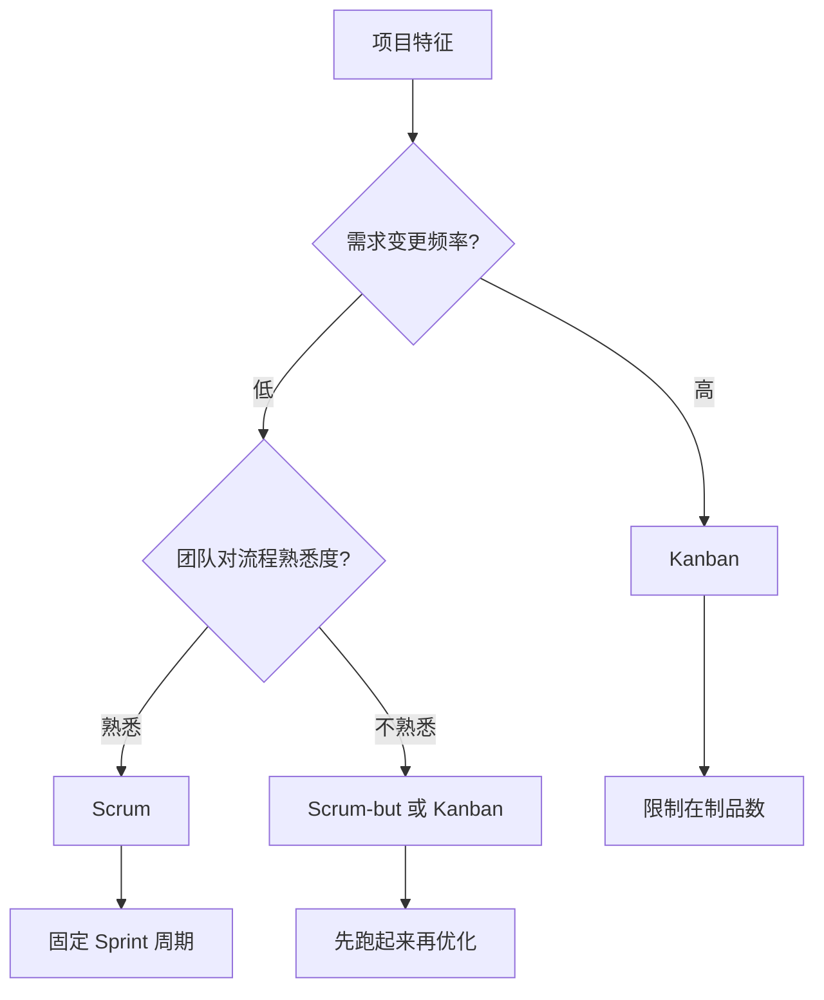

# L05 项目管理与交付

> 目标：掌握敏捷、OKR、里程碑、风险管理和复盘机制，保障前端项目高质量、可持续交付。

---

## 核心要点（TL;DR）

- 项目管理能力是把技术工作组织成可预测、可度量的业务结果。
- 项目生命周期分为启动、规划、执行、监控、收尾五个阶段。
- 敏捷与 OKR 结合，可以让团队在正确方向上快速迭代。
- 风险管理要提前识别、量化并制定应对策略。
- 质量管理需要建立门禁和指标，而不是依赖后期检查。
- 项目复盘要形成可跟进的改进行动，避免问题反复出现。

---

## 1. 为什么架构师要懂项目管理？

前端架构师不仅要设计系统，还要确保架构方案能落地。项目管理能力让你：

- 把宏大目标拆解为可执行里程碑。
- 识别并降低技术、资源、进度风险。
- 在约束条件下做出最优技术决策。
- 让团队交付节奏稳定、可预测。

---

## 2. 项目管理核心框架

### 2.1 项目生命周期

| 阶段 | 关键任务 | 输出物 |
|------|----------|--------|
| 启动 | 明确目标、范围、干系人 | 项目章程、OKR |
| 规划 | 拆解任务、评估工时、排期 | 项目计划、里程碑 |
| 执行 | 开发、评审、测试、集成 | 代码、文档、迭代版本 |
| 监控 | 进度、质量、风险跟踪 | 周报、仪表盘 |
| 收尾 | 验收、复盘、知识沉淀 | 复盘报告、SOP |

### 2.2 项目章程模板

```markdown
# 项目章程：前端性能优化项目

## 背景
当前平台首页 FCP 3.5s，跳出率 45%，影响用户体验和业务转化。

## 目标
- FCP 降至 1.5s 以内
- LCP 降至 2.0s 以内
- 跳出率降低 15%

## 范围
- 首页、列表页、详情页性能优化
- 不包含：后台管理系统、移动端

## 关键干系人
- 发起人：CTO
- 项目负责人：张三
- 核心团队：前端组（4人）、后端组（1人）、QA（1人）

## 关键里程碑
- M1（7/15）：完成性能基线测量和优化方案评审
- M2（8/15）：完成首页优化和灰度上线
- M3（9/15）：完成所有页面优化，全量上线

## 风险摘要
- 第三方 SDK 无法优化（高影响）
- 后端接口改造依赖（中影响）
```

### 2.3 敏捷、Scrum 与 Kanban 的辨析

很多团队混用这些概念，理解它们的区别对选择合适的方法至关重要：

| 维度 | 敏捷（Agile） | Scrum | Kanban |
|------|-------------|-------|--------|
| 本质 | 价值观和原则 | 特定框架 | 方法 |
| 迭代周期 | 推荐迭代式开发 | 固定周期（通常 1-4 周） | 无固定周期，持续流动 |
| 角色 | 无规定 | 固定角色（PO/SM/Dev） | 无规定 |
| 会议 | 推荐有，但无规定 | 固定的五种会议 | 无规定会议 |
| 变更 | 欢迎变化 | 迭代内一般不接受变更 | 可随时拉入 Backlog |
| 度量 | 交付价值 | Velocity | Cycle Time / Lead Time |
| 适用场景 | 不确定性强、需要快速反馈 | 团队成熟、需求相对明确 | 运维类、支持类、高频需求 |

**选择框架的决策指南**：



**Scrum 典型问题及解决方法**：

| 问题 | 原因 | 解决方法 |
|------|------|----------|
| Sprint 目标总完不成 | 承诺过多 | 用历史 velocity 估算，留缓冲 |
| Daily Standup 变成汇报 | 缺少聚焦 | 围绕 Sprint Backlog 过，不谈细节 |
| Retro 流于形式 | 没有行动项跟进 | 每次选 1-2 个改进点，下个 Sprint 验证 |
| PO 不在一个团队 | 沟通成本高 | 安排定期的 Product Refinement session |

**Kanban 核心实践**：

- **可视化工作流**：用看板展示所有任务的状态（To Do / In Progress / Review / Done）。
- **限制在制品（WIP Limit）**：限制每列的最大任务数，迫使团队先完成任务再开始新任务。
- **度量周期时间**：从任务开始到完成的时间，持续优化这个指标。
- **显式化流程规则**：明确"什么算完成"（DoD）、什么条件下可以拉入新任务。

### 2.4 敏捷在工程团队中的落地

敏捷不是"要开会"，而是"要反馈"。真正的敏捷落地体现在：

1. **快速验证假设**：不是一次把功能做完，而是先做最简可行版本（MVP）验证价值。
2. **频繁交付价值**：每次迭代交付对用户可见的价值，而非"半成品"。
3. **持续改进流程**：每个迭代回顾会上，团队主动发现问题并调整。
4. **技术实践配套**：CI/CD、自动化测试、重构是敏捷的技术基石，没有它们敏捷就是"快不起来"。

**敏捷落地的反模式**：

| 反模式 | 表现 | 修正方法 |
|--------|------|----------|
| 伪敏捷 | 会议全开但没有任何敏捷的价值观 | 回归敏捷原则，用 Retro 发现问题 |
| 敏捷剧场 | 有 Story Point 但没有交付价值 | 关注结果而非产出 |
| Sprint 僵尸 | 每周迭代但团队毫无激情 | 让团队参与 Sprint 目标制定 |
| 无底 Sprint | 不断往 Sprint 里加需求 | 严格执行 Sprint Backlog 冻结 |

### 2.5 OKR 与 KPI 的结合

- **OKR**：设定有野心的目标（Objective）和可衡量的关键结果（Key Results）。
- **KPI**：衡量日常运营效率和质量的指标。
- 两者结合：OKR 牵引方向，KPI 保障执行质量。

**OKR 设立原则**：

| 原则 | 说明 | 错误示例 | 正确示例 |
|------|------|----------|----------|
| 有野心 | O 要有挑战性，完成 70% 就算好 | O：保持系统稳定 | O：打造业界领先的前端性能体验 |
| 可衡量 | KR 必须有明确的数字 | KR：提升性能 | KR：FCP 从 3.5s 降到 1.5s |
| 对齐 | 与公司/部门目标对齐 | 团队自己想做啥做啥 | 团队 OKR 支撑部门 OKR |
| 透明 | 全员可见 | 存在领导的抽屉里 | 公开到 Wiki / 共享文档 |

**从 OKR 到 Sprint 的分解路径**：

```
公司 OKR
  └── 部门 OKR
        └── 团队 OKR
              └── 季度 OKR
                    └── 月度目标
                          └── Sprint Backlog
                                └── 每日任务
```

---

## 3. 计划与排期

### 3.1 工作分解结构（WBS）

把项目拆成可估算、可分配、可验证的最小单元：

```
项目目标
├── 模块 A
│   ├── 子任务 A1
│   ├── 子任务 A2
│   └── 子任务 A3
├── 模块 B
│   ├── 子任务 B1
│   └── 子任务 B2
└── 集成与验收
```

**WBS 分解原则**：

- **80 小时法则**：每个工作包不超过 80 小时（2 周），超过就要继续分解。
- **可交付物导向**：分解结果应该是可验证的交付物，而非活动。
- **100% 法则**：父级的工作内容 = 所有子级之和。

### 3.2 估算方法

| 方法 | 适用场景 | 说明 |
|------|----------|------|
| 故事点 | 敏捷团队 | 相对估算，反映复杂度 |
| 人天 | 固定范围项目 | 直接对应成本 |
| 三点估算 | 不确定性高 | 乐观、最可能、悲观取加权 |
| 类比估算 | 有历史项目参考 | 基于类似项目推算 |
| T-Shirt  sizing | 早期、粗粒度 | S/M/L/XL 分类 |

**故事点的正确使用**：

- **故事点是相对值**，不是时间。一个 5 点的故事应该是 1 点故事的 5 倍复杂度。
- **用 Planning Poker 做估算**：团队成员同时出牌，避免互相影响。
- **不要换算**：不要规定"1 点 = 4 小时"，这完全违背了故事点的初衷。
- **用 Velocity 建立节奏**：团队连续几个 Sprint 的平均完成点数就是 Velocity，用 Velocity 做承诺依据。

**Planning Poker 流程**：

1. Product Owner 讲解一个 User Story。
2. 团队讨论需求细节和实现方案（5-10 分钟）。
3. 每人同时出估算牌（斐波那契数列：1, 2, 3, 5, 8, 13, 21）。
4. 如果牌数差异大，最高和最低者分别说明理由。
5. 重新出牌直到达成一致。

**T-Shirt Sizing 速查表**：

| 尺寸 | 含义 | 前端典型范围 | 示例 |
|------|------|-------------|------|
| XS | 极简单 | 2-4 小时 | 文案修改、样式微调 |
| S | 简单 | 0.5-1 天 | 新增表单字段、简单组件 |
| M | 中等 | 1-3 天 | 新页面、中等复杂度组件 |
| L | 复杂 | 3-7 天 | 完整页面模块、复杂交互 |
| XL | 极复杂 | 7-15 天 | 架构改造、性能优化项目 |
| XXL | 史诗 | 2 周+ | 需进一步分解 |

**缓冲策略**：

| 类型 | 推荐比例 | 说明 |
|------|---------|------|
| 功能缓冲 | 20%-30% | 每个功能/模块内部预留 |
| 项目缓冲 | 15%-20% | 项目级整体预留 |
| 管理缓冲 | 5%-10% | 应对管理层临时需求变更 |

### 3.3 关键路径法（CPM）

- 识别任务依赖关系。
- 找出决定项目最短工期的关键路径。
- 优先保障关键路径上的资源。

**常见任务依赖类型**：

| 依赖类型 | 说明 | 前端示例 |
|----------|------|----------|
| 完成-开始（FS） | A 完成后 B 才能开始 | UI 设计完成 -> 前端开发 |
| 开始-开始（SS） | A 开始后 B 可以开始 | 前端开发开始 -> 接口联调准备 |
| 完成-完成（FF） | A 完成后 B 可以完成 | 前端测试完成 -> QA 验收完成 |
| 开始-完成（SF） | A 开始后 B 才能完成 | 较少见 |

**缩短工期的方法**：

- **快速跟进**：串行变并行（增加风险）。
- **赶工**：增加资源（成本增加，边际递减）。
- **缩小范围**：砍掉非核心功能（最安全）。
- **外包**：专业的事给专业的人（管理成本增加）。

### 3.4 前端 Sprint Planning 实践

前端开发的特殊性决定了 Sprint Planning 需要关注：

| 特殊性 | 影响 | 应对 |
|--------|------|------|
| 跨端兼容 | 测试范围大 | 预留兼容性测试时间 |
| UI 还原度 | 需要设计对齐 | 与设计定好组件的 DoD |
| 性能敏感性 | 容易影响用户体验 | 性能纳入每个 Story 的验收标准 |
| 版本碎片化 | 浏览器/设备碎片 | 确定最低支持版本，建立兼容性矩阵 |
| 联调依赖 | 依赖后端接口 | 优先 Mock，先行开发 |

**Sprint Planning 会议模板**：

```
Sprint X Planning

目标：
- [主要业务目标]
- [技术改进目标]

容量：
- 团队可用人天：N
- 假期/请假：N
- 实际可用：N

User Stories：
| Story | 点数 | 依赖 | 备注 |
|-------|------|------|------|
| ... | ... | ... | ... |

DoD（Definition of Done）：
- [ ] 代码已提交并 CR
- [ ] 单元测试覆盖
- [ ] 集成测试通过
- [ ] 性能基准达标
- [ ] UI 还原度确认
```

---

## 4. 风险管理

### 4.1 风险识别

常见前端项目风险：

- 技术风险：新技术不成熟、依赖库更新、浏览器兼容性。
- 人员风险：核心成员离职、技能不足。
- 进度风险：需求变更、估算不准、依赖阻塞。
- 质量风险：测试覆盖不足、性能不达标、安全漏洞。
- 外部风险：第三方服务变更、政策法规变化。

### 4.2 风险登记册

| 风险 | 可能性 | 影响 | 风险等级 | 应对策略 | 负责人 |
|------|--------|------|----------|----------|--------|
| 第三方 SDK 接口变更 | 中 | 高 | 高 | 提前 POC，保留回退方案 | 张三 |
| 性能指标不达标 | 中 | 中 | 中 | 早期埋点，灰度验证 | 李四 |
| 关键人员请假 | 低 | 高 | 中 | 交叉备份，文档完善 | 王五 |
| 需求范围扩大 | 高 | 中 | 高 | 变更控制流程，定期范围复审 | 赵六 |

**风险等级矩阵**：

| 可能性 \ 影响 | 低 | 中 | 高 |
|---------------|-----|-----|-----|
| 高 | 中 | 高 | 极高 |
| 中 | 低 | 中 | 高 |
| 低 | 低 | 低 | 中 |

### 4.3 风险管理流程

```
识别风险 -> 评估（可能性/影响） -> 优先级排序 -> 制定应对 -> 监控与更新
```

这个过程不是一次性的，而是贯穿项目始终，建议在每次 Sprint Planning 和 Retro 中留 5-10 分钟讨论风险。

### 4.4 应对策略

- **规避**：改变方案消除风险（如：不用有风险的三方库）。
- **转移**：外包、买保险（如：CDN 用云厂商的服务）。
- **减轻**：降低可能性或影响（如：增加测试覆盖度）。
- **接受**：准备应急计划（如：性能不达标时的降级方案）。

### 4.5 前端项目的常见风险与预防

| 风险 | 预防措施 | 应急措施 |
|------|----------|----------|
| 第三方 CDN 服务不可用 | 多 CDN 策略，备用域名 | 切换到备用 CDN |
| NPM 包被删除/投毒 | lockfile + 私有 registry + 定期 audit | 使用 fork 或替换库 |
| 浏览器新版本不兼容 | 自动化浏览器测试 + 灰度 | 针对特定浏览器降级处理 |
| 核心开发者离职 | 完善文档 + 多 Reviewer + 交叉培训 | 临时引入外部顾问 |
| 业务需求重大变更 | 里程碑 checkpoint + 变更控制 | 重新评估优先级和排期 |

### 4.6 依赖管理

前端项目依赖复杂，需要主动管理：

| 依赖类型 | 示例 | 管理策略 |
|----------|------|----------|
| 第三方库 | React、Lodash | 锁定版本，定期升级评估 |
| 内部模块 | 组件库、工具库 | 版本管理，Changelog |
| 后端 API | REST/GraphQL 接口 | 契约测试，Mock 先行 |
| 基础设施 | CI/CD 环境 | 基础设施即代码（IaC） |
| 设计资源 | 设计稿、组件规范 | 提前对齐，尽早验收 |

**前端依赖更新策略**：

```
依赖更新三角：
稳定性 —— 新特性
    \      /
    安全性
```

| 策略 | 说明 | 适合场景 |
|------|------|----------|
| 保守 | 只更新 patch 版本，不更新 minor/major | 生产环境、核心系统 |
| 定期 | 每月/每季度统一评估一次依赖升级 | 大多数业务项目 |
| 激进 | 关注最新版本，及时跟进 major 升级 | 技术前瞻项目、新项目 |

---

## 5. 质量管理

### 5.1 质量门禁

- 代码评审（Code Review）
- 自动化测试（单元、集成、E2E）
- 性能预算（Performance Budget）
- 安全扫描
- 可访问性检查

### 5.2 质量指标

- 缺陷密度（每千行代码的 bug 数）
- 测试覆盖率（行覆盖率、分支覆盖率）
- 构建成功率
- 线上事故数
- 用户反馈 NPS
- 代码重复率
- 技术债务比率

### 5.3 质量与进度的平衡

| 情景 | 策略 | 风险 |
|------|------|------|
| 进度严重滞后 | 缩减测试范围，保留核心场景 | 可能有漏测 |
| 质量不达标 | 延期上线 | 业务等待成本 |
| 两者都重要 | 减少 scope，保留核心功能 | 非核心功能延后 |

**黄金三角（不可能三角）**：

```
质量 ← → 进度
  ↑  ↗
  范围
```

项目管理的核心是在三者之间找到平衡。当进度收紧时，要么增加资源（成本），要么缩小范围。

---

## 6. 沟通与汇报

### 6.1 干系人管理

**干系人识别矩阵**：

| 干系人 | 影响力 | 关注度 | 沟通策略 |
|--------|--------|--------|----------|
| CTO | 高 | 高 | 定期汇报，提前预警 |
| PM | 中 | 高 | 每日同步，共同决策 |
| 设计师 | 低 | 中 | 按需沟通，对齐规范 |
| 市场团队 | 低 | 低 | 邮件同步关键里程碑 |

**干系人沟通计划模板**：

| 干系人 | 沟通方式 | 频率 | 内容 | 负责人 |
|--------|----------|------|------|--------|
| 项目发起人 | 邮件 + 月度会议 | 每月 | 整体进展、风险、预算 | 项目经理 |
| 业务负责人 | 周报 | 每周 | 功能交付、上线计划 | 技术负责人 |
| 开发团队 | 站会 + Sprint 回顾 | 每日/每两周 | 任务进展、技术问题 | 技术负责人 |
| QA 团队 | 测试会 | 每周 | 测试进度、缺陷统计 | QA Lead |
| 设计团队 | 设计评审会 | 按迭代 | 还原度、设计验收 | 前端负责人 |

### 6.2 项目仪表盘

- 进度完成率
- 剩余工时
- 缺陷趋势
- 阻塞问题清单
- 风险状态

### 6.3 周报模板

```markdown
## 本周进展
- 完成 XXX 模块开发
- 性能优化首屏下降 20%

## 下周计划
- 完成集成测试
- 提交验收

## 风险与阻塞
- 第三方接口延迟，可能影响 2 天

## 需要支持
- 申请测试资源
```

### 6.4 状态报告的三色法则

| 状态 | 含义 | 条件 | 行动 |
|------|------|------|------|
| 绿灯 | 一切正常 | 按计划推进，关键指标正常 | 定期关注 |
| 黄灯 | 有风险但可控 | 存在已知风险但有应对方案 | 上报，加强监控 |
| 红灯 | 严重问题 | 进度/质量/成本严重偏离 | 立刻上报，请求干预 |

**关键原则**：不要在状态报告里报绿灯但私下报红灯。诚实是信任的基础。

---

## 7. 项目复盘

### 7.1 复盘四步法

1. **回顾目标**：当初想达成什么？
2. **评估结果**：实际发生了什么？
3. **分析原因**：成功和失败的关键因素。
4. **总结经验**：哪些要保留，哪些要改进。

### 7.2 有效复盘的五个要素

| 要素 | 说明 | 做法 |
|------|------|------|
| 安全氛围 | 复盘不是追责 | 规则：不说"谁的问题"，说"系统/流程的问题" |
| 数据驱动 | 用数据说话 | 收集客观数据，避免凭感觉讨论 |
| 根因分析 | 找到真因 | 用 5 Whys 或因果图 |
| 行动导向 | 改进可执行 | 每个发现对应一个行动项 |
| 持续跟踪 | 闭环验证 | 下次复盘先回顾上次行动项进展 |

### 7.3 复盘模板

```markdown
# 项目复盘

## 项目概况
- 目标：
- 周期：
- 团队：

## 结果对比
| 指标 | 目标 | 实际 | 差异 |

## 做得好
- 

## 待改进
- 

## 根因分析
- 问题 1：根因分析 -> 系统性改进
- 问题 2：根因分析 -> 系统性改进

## 行动项
| 行动 | 负责人 | 完成时间 |
|------|--------|----------|

## 下次复盘跟踪
- 上次行动项完成情况
```

### 7.4 Sprint Retro 的格式创新

Sprint Retro 容易陷入固定模式，可以每轮换一种形式：

| 形式 | 方法 | 适用场景 |
|------|------|----------|
| Start/Stop/Continue | 开始做 / 停止做 / 继续做 | 常规迭代 |
| 4L 模型 | Liked / Learned / Lacked / Longed For | 深度反思 |
| 海星模型 | Start / Stop / Continue / More of / Less of | 渐变改进 |
| 问问题 | "这个 Sprint 你最后悔什么？最自豪什么？" | 团队疲劳期 |
| 数据分析 | Velocity 趋势、缺陷率、自动化测试覆盖 | 需要数据时 |

---

## 8. OKR 驱动的交付管理

### 8.1 从 OKR 到任务

```
Objective: 打造行业领先的用户体验
  ├── KR1: FCP 降低到 1.5s
  │     ├── 关键结果拆解
  │     │   ├── 完成性能基线搭建
  │     │   ├── 实现 SSR 改造
  │     │   ├── 实施图片懒加载和 CDN
  │     │   └── 首屏关键 CSS 内联
  │     └── 对应 Sprint 任务
  ├── KR2: 核心页面 NPS 达到 60
  │     └── (Sprint 对应任务)
  └── KR3: 构建时间降低到 5 分钟
        └── (Sprint 对应任务)
```

### 8.2 进度追踪

| 维度 | 跟踪方式 | 更新频率 |
|------|----------|----------|
| OKR 进度 | KR 百分比 | 每周更新 |
| Sprint 进度 | Burn-down Chart | 每日 |
| 里程碑 | 时间线 + Gates | 每阶段 |
| 质量 | 缺陷率 + 测试覆盖 | 持续跟踪 |

### 8.3 项目成功的衡量标准

不只看"是否上线"，而是看：

1. **业务价值是否实现**：KR 是否达成？
2. **质量是否达标**：线上故障数、性能指标。
3. **团队是否进步**：团队能力是否得到提升？
4. **知识是否沉淀**：文档、复盘报告、SOP 是否完善？
5. **干系人是否满意**：反馈如何？

---

## 9. 常见误区

- **只排开发时间，忽略测试、联调、返工**：应预留 20%-30% 缓冲。
- **过度承诺**：在压力下一味压缩工期，导致质量崩塌。
- **缺少风险管理**：等问题爆发才处理，代价更高。
- **复盘流于形式**：没有行动项和跟进，问题反复出现。
- **混淆 Agile 和 Scrum**：Scrum 只是 Agile 的一种实现方式。
- **OKR 和 KPI 混用**：OKR 是方向，KPI 是基线。
- **把 Bug 数和代码行数作为考核指标**：引导了错误的行为。

---

## 10. 相关领域

- L01 业务理解：目标对齐与业务价值评估。
- L02 团队建设：团队资源与协作机制。
- E03 CI/CD：自动化交付管线。
- A06 可观测性：数据驱动的项目监控。
- L04 沟通表达：干系人沟通与汇报。

---

**标签**：`#project-management` `#agile` `#scrum` `#kanban` `#okr` `#risk-management` `#delivery` `#sprint-planning` `#estimation`

> **最后更新**：2026-06-25


---

## 本领域学习进度

<MarkComplete domainId="project-management" />
<ProgressTracker />
